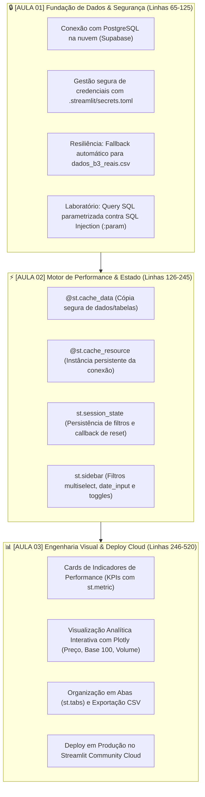

# 📈 Dashboard Financeiro B3 | Projeto Integrador da Semana

Projeto prático desenvolvido para o módulo de **Visualização de Dados e Business Intelligence (Módulo 2 • Semana 11 - Streamlit Avançado)** da **FIESC / SENAI**.

Este projeto foi estruturado como uma **aplicação corporativa viva (`app.py`)**, construída e aprimorada progressivamente ao longo das 3 aulas da semana, saindo do banco relacional na nuvem até o deploy final em produção.

---

## 🎯 Trilha Pedagógica no `app.py`

O código do arquivo [`app.py`](app.py) é dividido exatamente de acordo com as 3 aulas do curso:



---

## 📁 Estrutura Enxuta do Repositório

```text
├── .streamlit/
│   ├── config.toml           # Configurações de tema escuro e interface
│   ├── secrets.toml          # Suas credenciais do Supabase (NÃO versionado no Git)
│   └── secrets.toml.example  # Modelo seguro para os alunos
├── .gitignore                # Proteção contra vazamento de credenciais e venv
├── dados_b3_reais.csv        # Base histórica real de ações da B3 (130k+ linhas)
├── schema_supabase.sql       # Script DDL da tabela acoes_b3 e índices
├── load_supabase.py          # Script de migração dos dados para o Supabase
├── app.py                    # APLICAÇÃO COMPLETA (Projeto Integrador da Semana)
├── requirements.txt          # Dependências do projeto (compatíveis com a nuvem)
└── README.md                 # Documentação e guia da semana
```

---

## 💻 Como Rodar o Projeto Localmente

### 1. Clonar o Repositório e Instalar Dependências
```bash
# Instalar bibliotecas necessárias
pip install -r requirements.txt
```

### 2. Configurar os Segredos (`secrets.toml`)
No diretório `.streamlit/`, copie o arquivo de exemplo:
* **Windows (PowerShell):**
  ```powershell
  Copy-Item .streamlit\secrets.toml.example .streamlit\secrets.toml
  ```
* Abra `.streamlit/secrets.toml` e insira as credenciais do seu Supabase (Pooler na porta 6543):
  ```toml
  [connections.postgresql]
  dialect = "postgresql"
  host = "aws-0-us-east-2.pooler.supabase.com"
  port = 6543
  database = "postgres"
  username = "postgres.adtvjcplizwuellgzuyr"
  password = "SUA_SENHA_DO_BANCO"
  ```

> 🛡️ **Garantia de Resiliência:** Caso você não configure o banco ou fique sem internet, o aplicativo entrará automaticamente no modo **Fallback Local** lendo o `dados_b3_reais.csv` com aviso visual e diagnóstico do erro.

### 3. Executar o Aplicativo
```bash
streamlit run app.py
```
O Streamlit abrirá no navegador em `http://localhost:8501`.

---

## 🎓 Laboratório Pedagógico Integrado

Dentro do próprio [`app.py`](app.py), a 3ª aba (**"🎓 Conceitos Pedagógicos da Aula"**) traz simuladores interativos para projeção em sala de aula:
1. **Slide 15 (Aula 1):** Executor interativo de queries parametrizadas com `:ticker` e `:limite` prevenindo SQL Injection.
2. **Slide 22 e 23 (Aula 2):** Guia comparativo entre `@st.cache_data` e `@st.cache_resource`.
3. **Slide 39 (Aula 3):** Checklist do desafio final para deploy corporativo.

---

## ☁️ Deploy no Streamlit Community Cloud

1. Suba as alterações para o seu repositório no **GitHub**.
2. Acesse [share.streamlit.io](https://share.streamlit.io) e conecte sua conta.
3. Crie um **New App**:
   * **Repository:** seu usuário / repositório
   * **Branch:** `main`
   * **Main file path:** `app.py`
4. Em **Advanced Settings -> Secrets**, cole o conteúdo de `.streamlit/secrets.toml`.
5. Clique em **Deploy!** Seu dashboard estará online com link público em menos de 2 minutos.
